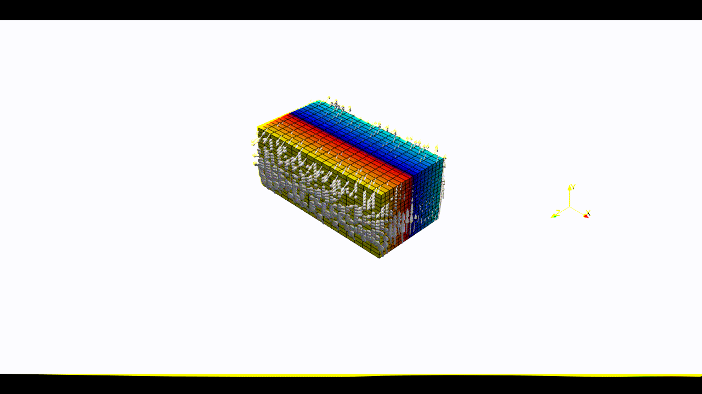

Arbitrary Lagrangian Eulerian (ALE) model
.........................................
This example shows how to generate the options for an ALE model with `pTatin3d`_, focusing 
on an oblique extension model with mesh motion along the :math:`x` and :math:`z` directions.
It is called ALE because although the mesh moves with the fluid, its velocity is *not exactly* the same as the fluid velocity.
Rather, the ALE velocity can use arbitrary components of the fluid velocity to move the mesh and ensures, whatever the component selcted, 
that the domain remains rectangular and that elements are not distorted.

1. Create a domain
~~~~~~~~~~~~~~~~~~~
We define a 3D :py:class:`ALE Domain <genepy.DomainALE>` 
:math:`\Omega = [0,600]\times[-250,0]\times[0,300]` km\ :sup:`3` 
:math:`\in \mathbb R^3` discretized by a regular grid of 9x9x9 nodes. 

.. code-block:: python

  import os
  import numpy as np
  import genepy as gp

  # Domain parameters
  dimensions = 3
  O = np.array([0,-250e3,0],    dtype=np.float64) # Origin
  L = np.array([600e3,0,300e3], dtype=np.float64) # Length
  n = np.array([9,9,9],         dtype=np.int32)   # Number of Q1 nodes i.e. elements + 1
  # Create DomainALE class instance
  Domain = gp.DomainALE(dimensions,O,L,n)

2. Velocity function
~~~~~~~~~~~~~~~~~~~~
We define an oblique extension :py:class:`velocity <genepy.VelocityLinear>` velocity field
forming an angle of 30 degrees counter-clockwise with respect to the :math:`z` axis.
The :py:class:`VelocityLinear <genepy.VelocityLinear>` class attributes 

- :py:attr:`u <genepy.VelocityLinear.u>` is the symbolic velocity function
- :py:attr:`grad_u <genepy.VelocityLinear.grad_u>` is the symbolic gradient of the velocity function
- :py:attr:`u_dir_horizontal <genepy.VelocityLinear.u_dir_horizontal>` is the orientation of the horizontal velocity at the boundary

.. code-block:: python

  # velocity
  cma2ms  = 1e-2 / (3600.0 * 24.0 * 365.0) # cm/a to m/s conversion
  u_norm  = 1.0 * cma2ms                   # horizontal velocity norm
  u_angle = np.deg2rad(30.0)               # velocity angle \in [-pi/2, pi/2]
  u_dir   = "z"                            # direction in which velocity varies
  u_type  = "extension"                    # extension or compression
  # Create Velocity class instance
  BCs = gp.VelocityLinear(Domain,u_norm,u_dir,u_type,u_angle)

  # Access the symbolic velocity function, its gradient and the orientation of the horizontal velocity at the boundary
  u      = BCs.u                # velocity function
  grad_u = BCs.grad_u           # gradient of the velocity function
  uL     = BCs.u_dir_horizontal # orientation of the horizontal velocity at the boundary (normalized)

3. Initial conditions
~~~~~~~~~~~~~~~~~~~~~
In this example we do not impose any initial plastic strain value nor mesh refinement.
Therefore the :py:class:`initial conditions <genepy.InitialConditions>` 
are only the Domain and the velocity function.
They will be used to generate the options for `pTatin3d`_ model.

.. code-block:: python

  # initial conditions
  model_ics = gp.InitialConditions(Domain,u)

4. Boundary conditions
~~~~~~~~~~~~~~~~~~~~~~
Because the imposed velocity is oblique to the boundary we define the
velocity boundary conditions using :py:class:`Dirichlet <genepy.Dirichlet>` and
:py:class:`Navier-slip <genepy.NavierSlip>` type :py:class:`boundary conditions <genepy.ModelBCs>`.
Note that the Dirichlet conditions takes the 2 horizontal components to impose the obliquity. 

Details on the methods used to define the boundary conditions can be found in the
:doc:`boundary conditions <../boundary_conditions>` section.

.. warning:: 
  As opposed to models **not using the ALE feature**, the tagging of the boundaries using the mesh files is **disabled**.
  As a result, boundaries can only be tagged by entire face following the numbering:

  - ``0``: xmax = imax = east  = HEX_FACE_Pxi
  - ``1``: xmin = imin = west  = HEX_FACE_Nxi
  - ``2``: ymax = jmax = north = HEX_FACE_Peta
  - ``3``: ymin = jmin = south = HEX_FACE_Neta
  - ``4``: zmax = kmax = front = HEX_FACE_Pzeta
  - ``5``: zmin = kmin = back  = HEX_FACE_Nzeta
  
  **Only** the integer values above are accepted as boundary tags any other value will produce an error in `pTatin3d`_.

.. code-block:: python

  # boundary conditions
  # path to mesh files (system dependent, change accordingly)
  root = os.path.join(os.environ['PTATIN'],"ptatin-gene/src/models/gene3d/examples")
  # Velocity boundary conditions
  u_bcs = [
    gp.Dirichlet(     4,"Zmax",["x","z"],u),
    gp.Dirichlet(     5,"Zmin",["x","z"],u),
    gp.NavierSlip(    0,"Xmax",grad_u,uL),
    gp.NavierSlip(    1,"Xmin",grad_u,uL),
    gp.DirichletUdotN(3,"Bottom")
  ]
  # Temperature boundary conditions
  Tbcs = gp.TemperatureBC({"ymax":0.0, "ymin":1450.0})
  # collect all boundary conditions
  model_bcs = gp.ModelBCs(u_bcs,Tbcs)

5. Material parameters
~~~~~~~~~~~~~~~~~~~~~~
Next we define the material properties of each :py:class:`Region <genepy.Region>` and 
gather them all in a :py:class:`ModelRegions <genepy.ModelRegions>` class instance.
In this example we use the default values for **all regions**:

- :py:class:`Constant viscosity <genepy.ViscosityConstant>` of :math:`10^{22}` Pa.s.
- :py:class:`Constant density <genepy.DensityConstant>` of :math:`3300` kg.m\ :sup:`-3`.
- :py:class:`No plasticity <genepy.PlasticNone>`.
- :py:class:`No softening <genepy.SofteningNone>`.

.. code-block:: python

  regions = [
    # Upper crust
    gp.Region(38),
    # Lower crust
    gp.Region(39),
    # Lithosphere mantle
    gp.Region(40),
    # Asthenosphere
    gp.Region(41)
  ]
  model_regions = gp.ModelRegions(regions,
                                  mesh_file=os.path.join(root,"box_ptatin_md.bin"),
                                  region_file=os.path.join(root,"box_ptatin_region_cell.bin"))

6. Create the model and generate options
~~~~~~~~~~~~~~~~~~~~~~~~~~~~~~~~~~~~~~~~~
Finally, we create the :py:class:`model <genepy.Model>` by gathering all the information defined previously and we save
the options to a file named ``mesh_ale.opts``.

.. note:: 
  By default, the ALE feature uses **all** components of the velocity.
  Arbitrary components can be disabled by setting the ``ale_rm_component`` keyword argument to the components to remove.
  Accepted values are ``"x"``, ``"y"`` and ``"z"``. Must be passed as a list e.g., ``["x","y"]``.

.. code-block:: python

  model = gp.Model(model_ics,model_regions,model_bcs,
                   ale_rm_component=["y","z"])
  with open("mesh_ale.opts","w") as f:
    f.write(model.options)