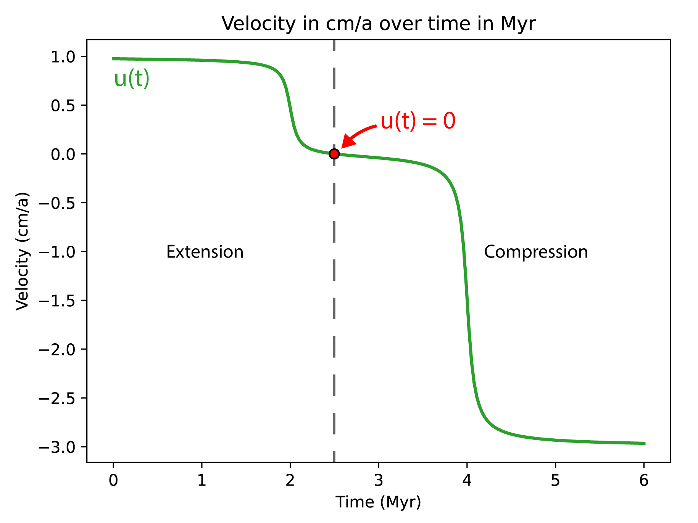

Example: Two phases model, extension followed by compression
............................................................
This example shows how to build a model with 2 tectonic phases.
For the example we consider a model with a first phase of orthogonal extension followed by a second phase of oblique compression.
Following the same pattern, it is possible to have a first phase of compression followed by a second phase of extension.
However, the example only covers a model with **two** tectonic phases.
No API is currently available for more than two phases but it is theoretically possible.

.. note:: 
  This example shows a case where the direction of extension and compression are different.
  In the case they are the same, it is not required to produce one options file per phase.

.. image:: ../figures/velocity_inversion.gif
    :width: 600

1. Create a domain
~~~~~~~~~~~~~~~~~~~
We define a 3D :py:class:`Domain <genepy.Domain>` :math:`\Omega = [0,600]\times[-250,0]\times[0,300]` km\ :sup:`3`
:math:`\in \mathbb R^3` discretized by a regular grid of 9x9x9 nodes.

.. code-block:: python

  import os
  import numpy as np
  import genepy as gp

  # 3D domain
  dimensions = 3
  O = np.array([0,-250e3,0],    dtype=np.float64) # Origin
  L = np.array([600e3,0,300e3], dtype=np.float64) # Length
  n = np.array([9,9,9],         dtype=np.int32)   # Number of Q1 nodes i.e. elements + 1
  # Create Domain class instance
  Domain = gp.Domain(dimensions,O,L,n)

2. Velocity field
~~~~~~~~~~~~~~~~~
We define two velocity fields, one for the extension phase and one for the compression phase.

2.1. Extension phase
++++++++++++++++++++
The extension velocity field is defined as a orthogonal extension of 1 cm.a\ :sup:`-1` in the :math:`x` direction.

.. code-block:: python

  u_params  = {"u_norm"        : 1.0 * cma2ms,     # norm of the velocity on boundary
               "variation_dir" : "x",              # direction in which velocity varies 
               "velocity_type" : "extension",      # extension or compression (because norm > 0)
               "u_angle"       : np.deg2rad(90.0)  # angle of the velocity vector
              }
  # Create linear velocity class instance
  phase_1   = gp.VelocityLinear(Domain,**u_params)

2.2. Compression phase
+++++++++++++++++++++++
The compression velocity field is defined as a 45 degrees compression of 3 cm.a\ :sup:`-1` in 
the :math:`x` direction.

.. code-block:: python

  u_params  = {"u_norm"        : 3.0 * cma2ms,     # norm of the velocity on boundary
               "variation_dir" : "x",              # direction in which velocity varies 
               "velocity_type" : "compression",    # extension or compression (because norm > 0)
               "u_angle"       : np.deg2rad(45.0)  # angle of the velocity vector
              }
  # Create linear velocity class instance
  phase_2   = gp.VelocityLinear(Domain,**u_params)

2.3. Combine the two phases
+++++++++++++++++++++++++++
First we define the time at which the tectonic phases change:

.. code-block:: python

  # time inversion parameters
  Ma2s = (3600.0 * 24.0 * 365.0) * 1e6 # Million years to second conversion
  t1   = 2.0 * Ma2s
  t2   = 4.0 * Ma2s
  breakpoints = np.array([ t1, t2 ],       dtype=np.float64) # breakpoints in time (where atan(t-t0)=0 )
  slopes      = np.array([ 5e-13, 5e-13 ], dtype=np.float64) # slope s of h(t) = s(t-t0) for atan(h(t)) function

Then we combine the two velocity fields  and evaluate the time-dependant velocity 
using the :py:class:`VelocityInversion <genepy.VelocityInversion>` class

.. code-block:: python

  # create time dependant velocity inversion class instance
  bc_inv = gp.VelocityInversion(Domain,phase_1,phase_2,breakpoints,slopes)

  # Access the symbolic velocity function, its gradient and the orientation of the horizontal velocity at the boundary
  u      = bc_inv.u                   # velocity function
  grad_u = bc_inv.grad_u              # gradient of the velocity function
  uL_1   = bc_inv.u_dir_horizontal[0] # orientation of the extension phase
  uL_2   = bc_inv.u_dir_horizontal[1] # orientation of the compression phase

To help visualize the resulting time dependant velocity function a 
:py:meth:`plotting method <genepy.VelocityInversion.plot_1D_velocity>` using matplotlib is available:

.. code-block:: python

  # plot the 1D velocity profile over time
  time_1d = np.linspace(0, 6, 201) * Ma2s # time array for plot
  bc_inv.plot_1D_velocity(time_1d)

This function uses the norm of the velocity to plot the velocity profile over time.
The sign convention used is that the velocity is positive for extension and negative for compression.
In addition, if the velocity should pass through zero over time a red dot is added to the plot.
To obtain the time at which the velocity evaluates to zero you can use the 
:py:meth:`get_time_zero_velocity() <genepy.VelocityInversion.get_time_zero_velocity>` method and print the result:

.. code-block::  python

  # time at which velocity is 0 during the tectonic regime inversion
  t0 = bc_inv.get_time_zero_velocity()
  print(f"Time at which velocity is 0: {t0/Ma2s} Myr")

3. Initial conditions
~~~~~~~~~~~~~~~~~~~~~
Gather the information defined previously to generate the options for the initial conditions.

.. code-block:: python

  # Initial conditions
  model_ics = gp.InitialConditions(Domain,u)

4. Boundary conditions
~~~~~~~~~~~~~~~~~~~~~~

.. warning:: 
  In this example, the extension and compression do not follow the same orientation i.e., 
  the extension is parallel to the :math:`x` axis and the compression is at 45 degrees.
  Therefore, the boundary conditions are defined for each phase separately and 2 options files 
  must be produced.
  This is necessary because the type of boundary conditions change between the two phases.
  In the case the orientation between the two phases does not change, their type can be the same and 
  only one options file is required.

4.1. Temperature boundary conditions
++++++++++++++++++++++++++++++++++++

.. code-block:: python

  Tbcs = gp.TemperatureBC({"ymax":0.0, "ymin":1450.0})

4.2. Extension phase
++++++++++++++++++++
The extension phase is defined as an orthogonal extension, therefore we can define all BCs as 
:py:class:`Dirichlet <genepy.Dirichlet>`:

.. code-block:: python

  # path to mesh files (system dependent, change accordingly)
  root = os.path.join(os.environ['PTATIN'],"ptatin-gene/src/models/gene3d/examples")
  # Velocity boundary conditions
  # zmax parameters
  zmax = {"tag"        :23, 
          "name"       :"Zmax", 
          "components" :["z"], 
          "velocity"   :u, 
          "mesh_file"  :os.path.join(root,"box_ptatin_facet_23_mesh.bin")}
  # Create Dirichlet boundary condition class instance for zmax face
  zmax_face = gp.Dirichlet(**zmax)

  # zmin parameters
  zmin = {"tag":37, 
          "name":"Zmin", 
          "components":["z"], 
          "velocity":u, 
          "mesh_file":os.path.join(root,"box_ptatin_facet_37_mesh.bin")}
  # Create Dirichlet boundary condition class instance for zmin face
  zmin_face = gp.Dirichlet(**zmin)
  
  # xmax parameters
  xmax = {"tag":32, 
          "name":"Xmax", 
          "components":["x"], 
          "velocity":u, 
          "mesh_file":os.path.join(root,"box_ptatin_facet_32_mesh.bin")}
  # Create Navier slip boundary condition class instance for xmax face
  xmax_face = gp.Dirichlet(**xmax)
  
  # xmin parameters
  xmin = {"tag":14, 
          "name":"Xmin", 
          "components":["x"], 
          "velocity":u, 
          "mesh_file":os.path.join(root,"box_ptatin_facet_14_mesh.bin")}
  # Create Navier slip boundary condition class instance for xmin face
  xmin_face = gp.Dirichlet(**xmin)
  
  # bottom parameters
  bottom = {"tag":33, 
            "name":"Bottom", 
            "mesh_file":os.path.join(root,"box_ptatin_facet_33_mesh.bin")}
  # Create DirichletUdotN boundary condition class instance for bottom face
  bottom_face = gp.DirichletUdotN(**bottom)

  # collect stokes boundary conditions in a list
  bcs = [zmax_face,zmin_face,xmax_face,xmin_face,bottom_face]

  # collect all boundary conditions
  bc_phase_1 = gp.ModelBCs(bcs,Tbcs)

4.3. Compression phase
++++++++++++++++++++++
The compression phase is defined as a 45 degrees compression, therefore we need to define the boundary conditions
as a combination of :py:class:`Dirichlet <genepy.Dirichlet>` and :py:class:`Navier-slip <genepy.NavierSlip>`:

.. code-block:: python

  # Velocity boundary conditions
  # zmax parameters
  zmax = {"tag"        :23, 
          "name"       :"Zmax", 
          "components" :["x","z"], 
          "velocity"   :u, 
          "mesh_file"  :os.path.join(root,"box_ptatin_facet_23_mesh.bin")}
  # Create Dirichlet boundary condition class instance for zmax face
  zmax_face = gp.Dirichlet(**zmax)

  # zmin parameters
  zmin = {"tag":37, 
          "name":"Zmin", 
          "components":["x","z"], 
          "velocity":u, 
          "mesh_file":os.path.join(root,"box_ptatin_facet_37_mesh.bin")}
  # Create Dirichlet boundary condition class instance for zmin face
  zmin_face = gp.Dirichlet(**zmin)
  
  # xmax parameters
  xmax = {"tag":32, 
          "name":"Xmax", 
          "grad_u":grad_u, 
          "u_orientation":uL, 
          "mesh_file":os.path.join(root,"box_ptatin_facet_32_mesh.bin")}
  # Create Navier slip boundary condition class instance for xmax face
  xmax_face = gp.NavierSlip(**xmax)
  
  # xmin parameters
  xmin = {"tag":14, 
          "name":"Xmin", 
          "grad_u":grad_u, 
          "u_orientation":uL, 
          "mesh_file":os.path.join(root,"box_ptatin_facet_14_mesh.bin")}
  # Create Navier slip boundary condition class instance for xmin face
  xmin_face = gp.NavierSlip(**xmin)
  
  # bottom parameters
  bottom = {"tag":33, 
            "name":"Bottom", 
            "mesh_file":os.path.join(root,"box_ptatin_facet_33_mesh.bin")}
  # Create DirichletUdotN boundary condition class instance for bottom face
  bottom_face = gp.DirichletUdotN(**bottom)

  # collect stokes boundary conditions in a list
  bcs = [zmax_face,zmin_face,xmax_face,xmin_face,bottom_face]
  # collect all boundary conditions
  bc_phase_2 = gp.ModelBCs(bcs,Tbcs)

5. Material parameters
~~~~~~~~~~~~~~~~~~~~~~
Next we define the material properties of each :py:class:`Region <genepy.Region>` and
gather them all in a :py:class:`ModelRegions <genepy.ModelRegions>` class instance.
To keep it simple we use the default parameters for all regions:

.. code-block:: python

  # material parameters
  regions = [
    # Upper crust
    gp.Region(38,energy=gp.Energy(0.0,3.3)),
    # Lower crust
    gp.Region(39,energy=gp.Energy(0.0,3.3)),
    # Lithosphere mantle
    gp.Region(40,energy=gp.Energy(0.0,3.3)),
    # Asthenosphere
    gp.Region(41,energy=gp.Energy(0.0,3.3))
  ]
  # path to mesh files (system dependent, change accordingly)
  root = os.path.join(os.environ['PTATIN'],"ptatin-gene/src/models/gene3d/examples")
  all_regions = gp.ModelRegions(regions,
                                mesh_file=os.path.join(root,"box_ptatin_md.bin"),
                                region_file=os.path.join(root,"box_ptatin_region_cell.bin"))

6. Create the model and generate options
~~~~~~~~~~~~~~~~~~~~~~~~~~~~~~~~~~~~~~~~~
Finally, we create the :py:class:`model <genepy.Model>` by gathering all the information defined previously.
However, because we have two tectonic phases, we need to produce two options files, one for each phase:

.. code-block:: python

  # write the options for ptatin3d
  model_phase_1 = gp.Model(model_ics,all_regions,bc_phase_1)
  model_phase_2 = gp.Model(model_ics,all_regions,bc_phase_2)
  
  with open("model_phase_1.opts","w") as f:
    f.write(model_phase_1.options)
  with open("model_phase_2.opts","w") as f:
    f.write(model_phase_2.options)

.. note:: 
  In practice, the two options files are run in sequence using the checkpointing capabilities of `pTatin3d`_.
  The standard procedure should be:

  1. Evaluate the time at which the velocity is zero using the :py:meth:`get_time_zero_velocity() <genepy.VelocityInversion.get_time_zero_velocity>` method.
  2. Run the first phase using the options file ``model_phase_1.opts``.
  3. When the time of the model reaches the time at which the velocity is zero, stop the simulation.
  4. Run the second phase using the options file ``model_phase_2.opts``.
  
  **If the first phase runs longer than the time at which the velocity is zero, 
  the checkpointing capability allows re-starting from any checkpointed time-step using the option**
  
  ``-restart_directory output_path/checkpoints/stepN`` where ``output_path`` is the path to the model output directory,
  and ``N`` is the number of the step from which you wish to restart and is located in the ``checkpoints`` subdirectory
  inside the model output directory.
