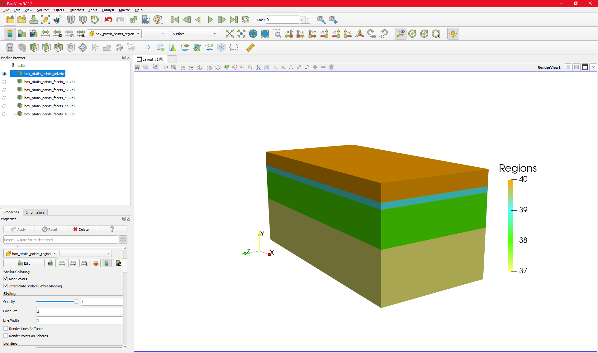
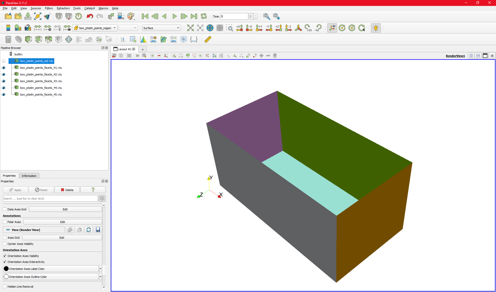

.. _Gmsh: https://gmsh.info/

Building a mesh with `Gmsh`_ for the initial geometry and boundary conditions
-----------------------------------------------------------------------------
`pTatin3d`_ represents the materials on lagrangian markers populating the domain.
The markers are attributed a "phase" index which is used to assign the material properties.
To generalise the creation of models with `pTatin3d`_ we rely on `Gmsh`_ to create
a mesh that will hold the initial geometry of the model and the physical position of the 
boundary conditions. 

.. note:: 
  The mesh created with `Gmsh`_ is **not** used to solve the problem, `pTatin3d`_
  creates its own structured mesh. 
  It is only used to create the initial geometry and identify boundaries.
  Therefore, the mesh should be as coarse as possible to fasten its creation, ease its
  portability between machines and fasten the location of the lagrangian markers from 
  `pTatin3d`_ inside this mesh.

.. note:: 
  It is strongly recommended for beginners to use the `Gmsh`_ GUI to build the mesh.
  A nice feature of `Gmsh`_ GUI is that you can edit the .geo file dynamically while 
  performing operations in the GUI. This is a good way to learn the syntax of the .geo file
  and understand how `Gmsh`_ works.

.. warning:: 
  When using a free-surface boundary condition for the surface of the domain, the mesh will deform.
  However, we use the `Gmsh`_ surfaces to define the boundary conditions in `pTatin3d`_. 
  Therefore, if the `pTatin3d`_ mesh falls outside the `Gmsh`_ mesh, the boundary conditions will not be applied.
  To prevent this, it is required to create a mesh with `Gmsh`_ taking in account that the surface in `pTatin3d`_ may uplift.
  To do so you can set the :math:`y` coordinate of the points defining the surface in `Gmsh`_ to an altitude that will never
  be reached in the geodynamic simulation.

1. Points
.........
The first step is to create the points that will define the geometry of the model.
Two possibilities are available to create points in `Gmsh`_:

- directly in the graphical interface with the Geometry :math:`\rightarrow` Elementary entities 
  :math:`\rightarrow` Add :math:`\rightarrow` Point
- by editing the .geo file using the following syntax:
  
  .. code-block:: c

    Point(1) = {0, 0, 0, lc};
    Point(2) = {1, 0, 0, lc};
    Point(3) = {1, 1, 0, lc};
    Point(4) = {0, 1, 0, lc};

  whith the syntax ``Point(i) = {x, y, z, lc};`` where ``i`` is the index of the point, 
  ``x``, ``y`` and ``z`` are the coordinates of the point and ``lc`` is the size of the mesh around the point.

.. note:: 
  Editing the .geo file is more efficient when creating a large number of points because
  it can be generated using a script.

In the `Gmsh`_ GUI you will obtain points as shown in the figure below:

.. figure:: figures/gmsh_imgs/box_points.png
   :align: center

2. Lines
........   
The next step is to connect points to create lines.
Lines should connect points to create closed loops that will next be utilised to define the surfaces of the model.
Lines should not cross each other. 
If they cross, prefer creating a point at the intersection and connect the lines to this point.

Just like for points, lines can be created in the GUI or by editing the .geo file.
In the GUI use Geometry :math:`\rightarrow` Elementary entities :math:`\rightarrow` Add :math:`\rightarrow` Line.
In the .geo file use ``Line(i) = {p1, p2};`` where ``i`` is the index of the line and ``p1`` and ``p2`` are the indices of the points.

You will obtain lines as shown in the figure below:

.. figure:: figures/gmsh_imgs/box_lines-01.png
   :align: center

3. Surfaces
...........
Once points closing a surface have been connected by lines the next step is to create the surfaces.
Surfaces can be created using the GUI with 
Geometry :math:`\rightarrow` Elementary entities :math:`\rightarrow` Add :math:`\rightarrow` Plane surface.
This tool will ask you to select the lines that close the surface:

.. figure:: figures/gmsh_imgs/box_lines_surf_bot-01.png
   :align: center

You need to repeat this operation for each surface of the model (both internal and external surfaces).
Again you can use the .geo file to create the surfaces.
However, at this point the organization of the .geo file starts to be more complex and keeping track of 
the indices of the lines that close the surfaces can be difficult.

4. Volumes
..........  
Once the surfaces have been created, the next step is to create the volumes.
Like surfaces, volumes are built by selecting the surfaces that close the volume.
This can be done in the GUI with
Geometry :math:`\rightarrow` Elementary entities :math:`\rightarrow` Add :math:`\rightarrow` Volume.

.. figure:: figures/gmsh_imgs/box_volume_bot-01.png
   :align: center

You need to repeat this operation for each volume of the model.

5. Physical groups
..................
Once the surfaces and volumes of the model have been created the next step is to define the physical groups.
Physical groups are used for two purposes:
1. To define the materials of the model.
2. To define the boundary conditions of the model.

When creating a physical group, `Gmsh`_ assigns a tag to the group.
`pTatin3d`_ uses this tag to identify the group and assign the correct material properties or boundary conditions.

.. warning:: pTatin3d cannot handle tags greater than 700. Please use tags smaller than 700.

To create a physical group in `Gmsh`_ with the GUI use
Geometry :math:`\rightarrow` Physical groups :math:`\rightarrow` Add :math:`\rightarrow` Surface for **surfaces** or
Geometry :math:`\rightarrow` Physical groups :math:`\rightarrow` Add :math:`\rightarrow` Volume for **volumes**.

These will ask you to select either volumes or surfaces you want to group as the same physical group.
It means that you can group several surfaces or volumes in the same physical group.
As an exemple, if you have two volumes separated in space but made of the same material, 
you can group them in the same physical group.
The same applies for boundary conditions, if you have two boundaries that have the same boundary condition,
you can group them in the same physical group.

.. note:: 
  You can choose the tag you want to apply to the physical group. 
  You can also choose the name of the physical group which helps to identify the group in the .geo file.
  The .geo file will record the physical groups with the following syntax:

  .. code-block:: c

    Physical Volume("upper_crust", 38) = {1};
    Physical Surface("zmax", 37) = {14, 15, 16, 17};

  In this exemple, ``"upper_cruts"`` is the name of the volume physical group, ``38`` its tag and ``{1}`` 
  the volumes that are in this group and
  ``"zmax"`` is the name of the surface physical group, ``37`` its tag and ``{14, 15, 16, 17}`` 
  the surfaces that are in this group.

.. figure:: figures/gmsh_imgs/box_volume_physical_bot-01.png
   :align: center

6. Mesh
........
Finally, once everything is set up, the last step is to create the mesh.
In the GUI use Mesh :math:`\rightarrow` 3D to create the mesh.

.. figure:: figures/gmsh_imgs/box_mesh.png
   :align: center

Once it is done you can save the mesh using File :math:`\rightarrow` Save mesh.

Again, this mesh is not utilised to solve any PDE. 
Therefore, try to create it the coarsest possible.

7. Export
The last step is to export the mesh from the .msh format to files that `pTatin3d`_ will interpret to create the model.
This step requires you to download and install the python package `gmsh_to_point_cloud <https://github.com/hpc4geo/gmsh_to_point_cloud>`_.
Follow the installation instructions on the github page of the package.
Once it is installed move to the branch of the package that is compatible with `pTatin3d`_:

.. code-block:: bash

  git checkout anthony_jourdon/surface-tag

Then you can generate the files for `pTatin3d`_ with:

.. code-block:: bash

  python parse_regions_from_gmsh.py -f your_mesh.msh

This will generate a set of files named:

- ``*_md.bin`` containing the mesh (element-to-vertex connectivity and vertices coordinates)
- ``*_region_cell.bin`` containing the region of each cell
- ``*_md.vtu`` combining the mesh and region cell in a .vtu file that can be visualised with Paraview to verify that it is what you expect.
- ``*_facet_*_mesh.bin`` containing the mesh of the facets of the model with its tag used for boundary conditions.
- ``*_facets_*.vtu`` which is the same than the .bin file but in .vtu format to visualise the facets with Paraview.

.. note:: Only the .bin files are used by `pTatin3d`_. The .vtu files are only for visualisation purposes.

As an example, here are the files generated for a simple model with 4 flat layers, a free-surface and 5 boundaries:

.. warning:: 
  Any portion of a boundary that is not tagged into a physical surface will be considered as a free-surface:

  .. math:: 
    \boldsymbol{\sigma} \mathbf{n} = \mathbf{0}

  Therefore, the top surface does not need to be tagged, however, if the gravity acceleration is non-zero, 
  using a free-surface boundary condition on any other face than the top face will lead to an outflow of material 
  under the effect of gravity.