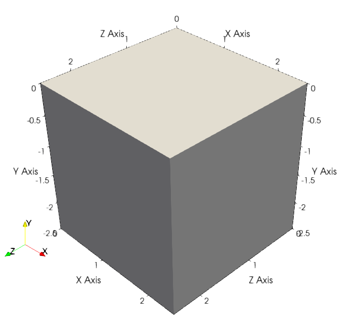

.. 
  ====================================================================================================
  Copyright (c) 2024, 
  Anthony Jourdon, 

  project:  Genepy
  filename: initial_conditions.rst

  This file is part of Genepy.

  Genepy is free software: you can redistribute it and/or modify it under the terms 
  of the GNU General Public License as published by the Free Software Foundation, either 
  version 3 of the License, or any later version.

  Genepy is distributed in the hope that it will be useful, but WITHOUT ANY WARRANTY; 
  without even the implied warranty of MERCHANTABILITY or FITNESS FOR A PARTICULAR PURPOSE. 
  See the GNU General Public License for more details.

  You should have received a copy of the GNU General Public License along with Genepy. 
  If not, see <https://www.gnu.org/licenses/>.
  ====================================================================================================

Initial conditions
==================
Contains the classes to define the initial conditions such as the 
geometry of the physical domain, the mesh refinement or an initial field with 
a gaussian distribution.
It generates symbolic expressions of the coordinates and initial field distribution.

Domain
------
In `pTatin3d`_, the physical domain where the simulation is performed
is defined by the coordinate system showed in the figure below.

The following code describes the physical domain.
While most of the usage of this class is for 3 dimensional domains,
it can also be used for 2 dimensional and 1 dimensional domains.

Eulerian Domain (with free-surface)
...................................

.. autoclass:: genepy.Domain
    :members:

ALE Domain
..........

In case an ALE simulation is performed, the domain can be defined as a moving domain.
Therefore, its minumum and maximum coordinates will change in time and expressions relying 
on the size of the domain need to consider this.
To do so, the following class introduce symbolic representation of the domain with the symbols
``"Ox", "Oy", "Oz"`` for the origin of the domain and ``"Lx", "Ly", "Lz"`` for the size of the domain.

.. autoclass:: genepy.DomainALE
    :members:

Mesh refinement
---------------
This module contains the class describing the mesh refinement.

.. autoclass:: genepy.MeshRefinement
    :members:

Rotation
--------
This module contains the class to perform rotations of single vectors, 
vector fields and referential in 2D and 3D.

.. autoclass:: genepy.Rotation
    :members:

Gaussian
--------
This module contains the class to evaluate gaussian distributions of a field in 2D.
It is generally used to define the initial strain distribution to place weak zones in the domain.

.. autoclass:: genepy.Gaussian
    :members:

.. autoclass:: genepy.GaussianConstructor
    :members:

.. autoclass:: genepy.Gaussian2D
    :members:

.. autoclass:: genepy.Gaussian3D
    :members:

.. autoclass:: genepy.GaussianPlane
    :members:

.. autoclass:: genepy.GaussianCircle
    :members:

Plastic strain
--------------
This module contains the class to generate options for the initial plastic strain.

.. autoclass:: genepy.InitialPlasticStrain
    :members:

Heat source
-----------
This module contains the class to generate options for the initial heat source when set to 
:py:class:`genepy.EnergySourceMaterialPointValue`.

.. autoclass:: genepy.InitialHeatSource
    :members:

ICs pTatin3d options generation
-------------------------------
This module contains the class to generate the options 
for the initial conditions of a 3D model running GENE3D 
in `pTatin3d`_.

.. autoclass:: genepy.InitialConditions
    :members:
