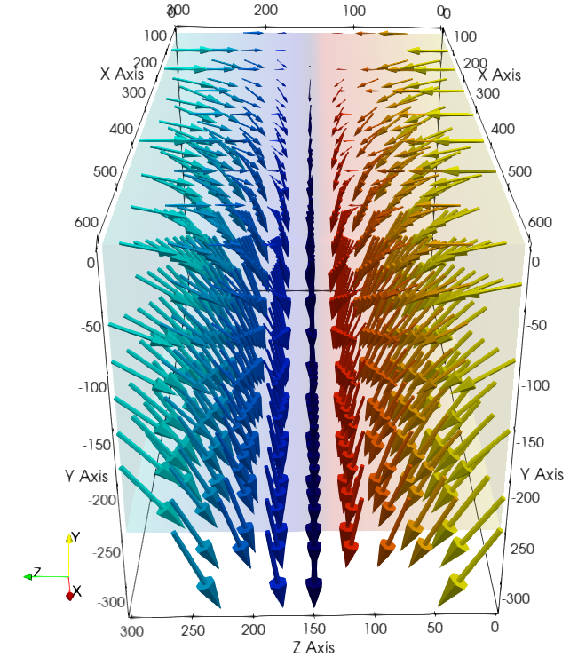
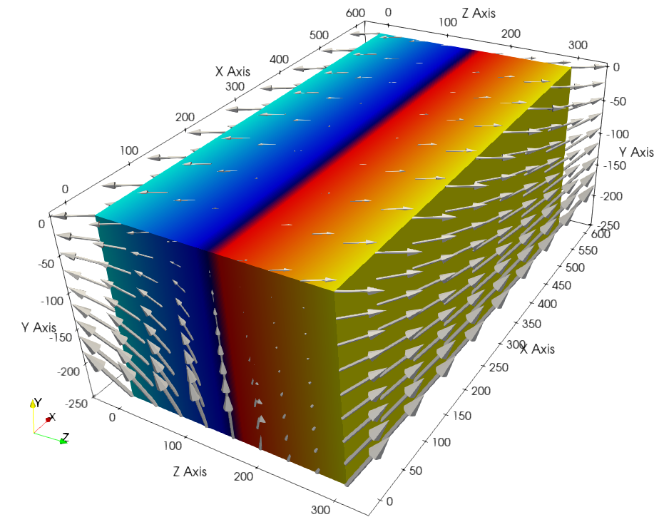
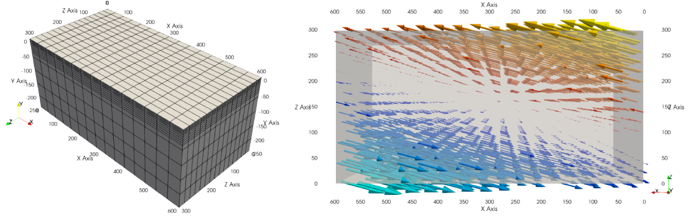
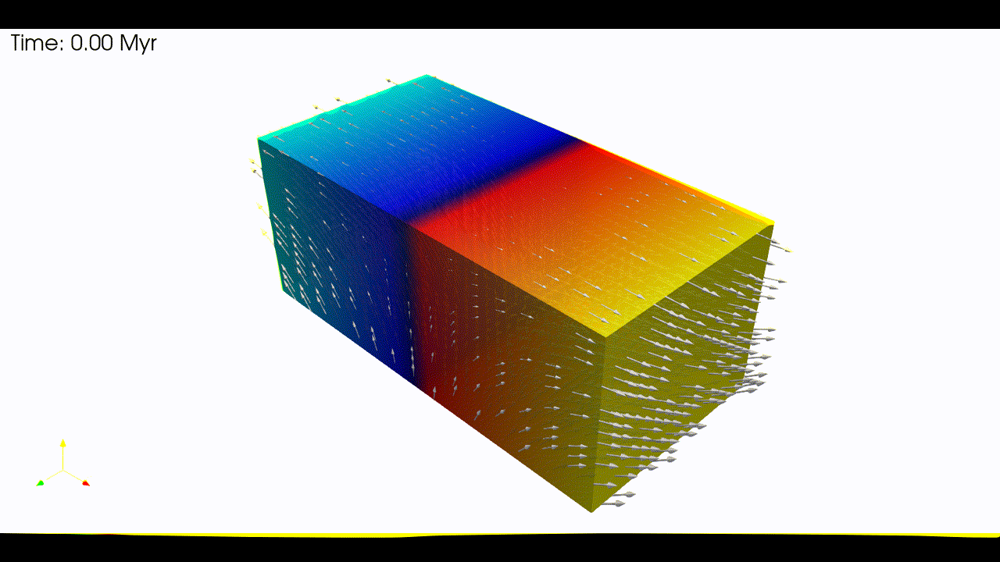

.. 
  ====================================================================================================
  Copyright (c) 2024, 
  Anthony Jourdon, 

  project:  Genepy
  filename: usage.rst

  This file is part of Genepy.

  Genepy is free software: you can redistribute it and/or modify it under the terms 
  of the GNU General Public License as published by the Free Software Foundation, either 
  version 3 of the License, or any later version.

  Genepy is distributed in the hope that it will be useful, but WITHOUT ANY WARRANTY; 
  without even the implied warranty of MERCHANTABILITY or FITNESS FOR A PARTICULAR PURPOSE. 
  See the GNU General Public License for more details.

  You should have received a copy of the GNU General Public License along with Genepy. 
  If not, see <https://www.gnu.org/licenses/>.
  ====================================================================================================

.. _pTatin3d: https://github.com/laetitialp/ptatin-gene

Usage
=====

.. _installation:

Installation
------------
First, this module requires python >= 3.10  and the following 
dependencies that can all be installed using pip

- numpy
- sympy
- matplotlib
- pyvista

To be able to import genepy module its location needs to be known by 
the environment variable **$PYTHONPATH**. 
To do so, move yourself in Genepy and type

.. code-block:: console

  source genepy.sh

This needs to be done every time a new terminal or python session is opened.
Another possibility is to add it to your bashrc or zshrc but it may be erased by python virtual environment when loaded.

Once your **$PYTHONPATH** has been appended check that it works correctly by typing

.. code-block:: python

  import genepy

in a python terminal. If no error is raised, the module is correctly installed.

Building a model
----------------
.. warning:: 
  In each examples, the following code blocks may re-use variables defined in previous blocks.
  To ensure that the code runs correctly, 
  it is recommended to run the code blocks in the order they are presented.

Example: simple model, linear viscous rheology
..............................................
This example shows how to build a very simple model using default linear viscous rheology 
and standard Dirichlet type boundary conditions for a velocity field imposing shortening in
:math:`z` direction as shown by the figure below.
Because the viscosity chosen in this example does not depend on temperature,
the thermal part of the model is not included.

1. Create a domain
~~~~~~~~~~~~~~~~~~~
We define a 3D :py:class:`domain <genepy.Domain>` :math:`\Omega = [0,600]\times[-250,0]\times[0,300]` km\ :sup:`3`
:math:`\in \mathbb R^3` discretized by a regular grid of 9x9x9 nodes.

.. code-block:: python

  import os
  import numpy as np
  import genepy as gp

  # 3D domain
  dimensions = 3
  O = np.array([0,-250e3,0],    dtype=np.float64) # Origin
  L = np.array([600e3,0,300e3], dtype=np.float64) # Length
  n = np.array([9,9,9],         dtype=np.int32)   # Number of Q1 nodes i.e. elements + 1
  # Create Domain class instance
  Domain = gp.Domain(dimensions,O,L,n)

2. Velocity function
~~~~~~~~~~~~~~~~~~~~
We define a simple orthogonal shortening :py:class:`velocity <genepy.VelocityLinear>` in the :math:`z` direction.

.. code-block:: python

  # velocity
  cma2ms  = 1e-2 / (3600.0 * 24.0 * 365.0) # cm/a to m/s conversion
  u_norm  = 1.0 * cma2ms                   # horizontal velocity norm
  u_dir   = "z"                            # direction in which velocity varies
  u_type  = "compression"                  # extension or compression
  # Create Velocity class instance
  BCs = gp.VelocityLinear(Domain,u_norm,u_dir,u_type)

  # Access the symbolic velocity function
  u = BCs.u

.. note:: In this example, the derivatives of the velocity are not used.

1. Initial conditions
~~~~~~~~~~~~~~~~~~~~~
In this example we do not impose any initial plastic strain value nor mesh refinement.
Therefore the :py:class:`initial conditions <genepy.InitialConditions>` are only the Domain and the velocity function.
They will be used to generate the options for `pTatin3d`_ model.

.. code-block:: python

  # Initial conditions
  model_ics = gp.InitialConditions(Domain,u)

4. Boundary conditions
~~~~~~~~~~~~~~~~~~~~~~
Because the imposed velocity is orthogonal to the boundary we can define the 
velocity boundary conditions using :py:class:`Dirichlet <genepy.Dirichlet>` type 
:py:class:`boundary conditions <genepy.ModelBCs>`.

.. note:: 
  In the following example a path to the mesh files describing the boundaries is provided.
  These mesh files are located in ``"ptatin-gene/src/models/gene3d/examples"``.
  You can modify the ``root`` variable to match the location of the mesh files on your system 
  or remove that part of the code if you do not have access to these files.
  Note however that `pTatin3d`_ requires mesh files to define the boundaries.

Details on the methods used to define the boundary conditions can be found in the
:doc:`boundary conditions <boundary_conditions>` section.

.. code-block:: python

  # boundary conditions
  # path to mesh files (system dependent, change accordingly)
  root = os.path.join(os.environ['PTATIN'],"ptatin-gene/src/models/gene3d/examples")
  # Velocity boundary conditions
  u_bcs = [
    gp.Dirichlet(23,"Zmax",["z"],u, mesh_file=os.path.join(root,"box_ptatin_facet_23_mesh.bin")), # orthogonal shortening
    gp.Dirichlet(37,"Zmin",["z"],u, mesh_file=os.path.join(root,"box_ptatin_facet_37_mesh.bin")), # orthogonal shortening
    gp.Dirichlet(32,"Xmax",["x"],u, mesh_file=os.path.join(root,"box_ptatin_facet_23_mesh.bin")), # free-slip
    gp.Dirichlet(14,"Xmin",["x"],u, mesh_file=os.path.join(root,"box_ptatin_facet_37_mesh.bin")), # free-slip
    gp.DirichletUdotN(33,"Bottom",  mesh_file=os.path.join(root,"box_ptatin_facet_33_mesh.bin")), # basal outflow
  ]
  # collect all boundary conditions
  model_bcs = gp.ModelBCs(u_bcs)

5. Material parameters
~~~~~~~~~~~~~~~~~~~~~~
Next we define the material properties of each :py:class:`Region <genepy.Region>` and 
gather them all in a :py:class:`ModelRegions <genepy.ModelRegions>` class instance.
In this example we use the default values for **all regions**:

- :py:class:`Constant viscosity <genepy.ViscosityConstant>` of :math:`10^{22}` Pa.s.
- :py:class:`Constant density <genepy.DensityConstant>` of :math:`3300` kg.m\ :sup:`-3`.
- :py:class:`No plasticity <genepy.PlasticNone>`.
- :py:class:`No softening <genepy.SofteningNone>`.

.. code-block:: python

  regions = [
    # Upper crust
    gp.Region(38),
    # Lower crust
    gp.Region(39),
    # Lithosphere mantle
    gp.Region(40),
    # Asthenosphere
    gp.Region(41)
  ]
  model_regions = gp.ModelRegions(regions,
                                  mesh_file=os.path.join(root,"box_ptatin_md.bin"),
                                  region_file=os.path.join(root,"box_ptatin_region_cell.bin"))

6. Create the model and generate options
~~~~~~~~~~~~~~~~~~~~~~~~~~~~~~~~~~~~~~~~~
Finally, we create the :py:class:`model <genepy.Model>` by gathering all the information defined previously and we save
the options to a file named ``simple_shortening_model.opts``.

.. code-block:: python

  # create class instance
  model = gp.Model(model_ics,model_regions,model_bcs)
  # write the options for ptatin3d
  with open("simple_shortening_model.opts","w") as f:
    f.write(model.options)

Example: oblique model, non-linear rheology
...........................................
In this example we build a model with an oblique velocity field to impose 
extension at 30 degrees (counter-clockwise) with respect to the :math:`z` axis 
(can be seen as north-south direction).
We use :py:class:`non-linear viscous <genepy.ViscosityArrhenius2>` rheology, 
:py:class:`Drucker-Prager plasticity <genepy.PlasticDruckerPrager>` and
a combination of :py:class:`Dirichlet <genepy.Dirichlet>` and 
:py:class:`Navier-slip <genepy.NavierSlip>` type boundary conditions.

1. Create a domain
~~~~~~~~~~~~~~~~~~~
We define a 3D domain :math:`\Omega = [0,600]\times[-250,0]\times[0,300]` km\ :sup:`3`
:math:`\in \mathbb R^3` discretized by a regular grid of 9x9x9 nodes.

.. code-block:: python

  import os
  import numpy as np
  import genepy as gp

  # 3D domain
  dimensions = 3
  O = np.array([0,-250e3,0],    dtype=np.float64) # Origin
  L = np.array([600e3,0,300e3], dtype=np.float64) # Length
  n = np.array([9,9,9],         dtype=np.int32)   # Number of Q1 nodes i.e. elements + 1
  # Create Domain class instance
  Domain = gp.Domain(dimensions,O,L,n)

2. Velocity function
~~~~~~~~~~~~~~~~~~~~
We define an oblique extension :py:class:`velocity <genepy.VelocityLinear>` velocity field
forming an angle of 30 degrees counter-clockwise with respect to the :math:`z` axis.
The method 
:py:meth:`evaluate_velocity_and_gradient_symbolic() <genepy.VelocityLinear.evaluate_velocity_and_gradient_symbolic>` 
returns the symbolic expression of the velocity field and its gradient.
The method
:py:meth:`evaluate_velocity_numeric() <genepy.VelocityLinear.evaluate_velocity_numeric>`
returns the numeric value of the velocity field evaluated at coordinates of the nodes.
The method
:py:meth:`get_velocity_orientation() <genepy.VelocityLinear.get_velocity_orientation>`
returns the orientation of the velocity field at the boundary.

.. code-block:: python

  # velocity
  cma2ms  = 1e-2 / (3600.0 * 24.0 * 365.0) # cm/a to m/s conversion
  u_norm  = 1.0 * cma2ms                   # horizontal velocity norm
  u_angle = np.deg2rad(30.0)               # velocity angle \in [-pi/2, pi/2]
  u_dir   = "z"                            # direction in which velocity varies
  u_type  = "extension"                    # extension or compression
  # Create Velocity class instance
  BCs = gp.VelocityLinear(Domain,u_norm,u_dir,u_type,u_angle)

  # Access the symbolic velocity function, its gradient and the orientation of the horizontal velocity at the boundary
  u      = BCs.u                # velocity function
  grad_u = BCs.grad_u           # gradient of the velocity function
  uL     = BCs.u_dir_horizontal # orientation of the horizontal velocity at the boundary (normalized)

1. Initial conditions
~~~~~~~~~~~~~~~~~~~~~
In this example we do not impose any initial plastic strain value nor mesh refinement.
Therefore the :py:class:`initial conditions <genepy.InitialConditions>` 
are only the Domain and the velocity function.
They will be used to generate the options for `pTatin3d`_ model.

.. code-block:: python

  # Initial conditions
  model_ics = gp.InitialConditions(Domain,u)

4. Boundary conditions
~~~~~~~~~~~~~~~~~~~~~~
Because the imposed velocity is oblique to the boundary we define the
velocity boundary conditions using :py:class:`Dirichlet <genepy.Dirichlet>` and
:py:class:`Navier-slip <genepy.NavierSlip>` type :py:class:`boundary conditions <genepy.ModelBCs>`.
Note that the Dirichlet conditions takes now the 2 horizontal components to impose the obliquity. 

Moreover, we will use non-linear viscosities depending of the temperature 
so we need to provide boundary conditions for the conservation of the thermal energy.

Details on the methods used to define the boundary conditions can be found in the
:doc:`boundary conditions <boundary_conditions>` section.

.. code-block:: python

  # boundary conditions
  # path to mesh files (system dependent, change accordingly)
  root = os.path.join(os.environ['PTATIN'],"ptatin-gene/src/models/gene3d/examples")
  # Velocity boundary conditions
  u_bcs = [
    gp.Dirichlet( 23,"Zmax",["x","z"],u, mesh_file=os.path.join(root,"box_ptatin_facet_23_mesh.bin")),
    gp.Dirichlet( 37,"Zmin",["x","z"],u, mesh_file=os.path.join(root,"box_ptatin_facet_37_mesh.bin")),
    gp.NavierSlip(32,"Xmax",grad_u,uL,   mesh_file=os.path.join(root,"box_ptatin_facet_32_mesh.bin")),
    gp.NavierSlip(14,"Xmin",grad_u,uL,   mesh_file=os.path.join(root,"box_ptatin_facet_14_mesh.bin")),
    gp.DirichletUdotN(33,"Bottom",       mesh_file=os.path.join(root,"box_ptatin_facet_33_mesh.bin")),
  ]
  # Temperature boundary conditions
  Tbcs = gp.TemperatureBC({"ymax":0.0, "ymin":1450.0})
  # collect all boundary conditions
  model_bcs = gp.ModelBCs(u_bcs,Tbcs)

5. Material parameters
~~~~~~~~~~~~~~~~~~~~~~
Next we define the material properties of each :py:class:`Region <genepy.Region>` and
gather them all in a :py:class:`ModelRegions <genepy.ModelRegions>` class instance.
In this example we use the following material types:

- :py:class:`Dislocation creep <genepy.ViscosityArrhenius2>`.
- :py:class:`Drucker-Prager <genepy.PlasticDruckerPrager>` plastic yield criterion.
- :py:class:`Linear softening <genepy.SofteningLinear>`.
- :py:class:`Boussinesq density <genepy.DensityBoussinesq>`.

.. code-block:: python

  regions = [
    # Upper crust
    gp.Region(38,                                          # region tag
              gp.DensityBoussinesq(2700.0,3.0e-5,1.0e-11), # density
              gp.ViscosityArrhenius2("Quartzite"),         # viscosity  (values from the database using rock name)
              gp.SofteningLinear(0.0,0.5),                 # softening
              gp.PlasticDruckerPrager(),                   # plasticity (default values, can be modified using the corresponding parameters)
              gp.Energy(1.5e-6,2.7)),                      # energy
    # Lower crust
    gp.Region(39,
              gp.DensityBoussinesq(density=2850.0,thermal_expansion=3.0e-5,compressibility=1.0e-11),
              gp.ViscosityArrhenius2("Anorthite",Vmol=38.0e-6),
              gp.SofteningLinear(strain_min=0.0,strain_max=0.5),
              gp.PlasticDruckerPrager(),
              gp.Energy(heat_source=0.5e-6,conductivity=2.85)),
    # Lithosphere mantle
    gp.Region(40,
              gp.DensityBoussinesq(3300.0,3.0e-5,1.0e-11),
              gp.ViscosityArrhenius2("Peridotite(dry)",Vmol=8.0e-6),
              gp.SofteningLinear(0.0,0.5),
              gp.PlasticDruckerPrager(),
              gp.Energy(0.0,3.3)),
    # Asthenosphere
    gp.Region(41,
              gp.DensityBoussinesq(3300.0,3.0e-5,1.0e-11),
              gp.ViscosityArrhenius2("Peridotite(dry)",Vmol=8.0e-6),
              gp.SofteningLinear(0.0,0.5),
              gp.PlasticDruckerPrager(),
              gp.Energy(0.0,3.3))
  ]
  model_regions = gp.ModelRegions(regions,
                                  mesh_file=os.path.join(root,"box_ptatin_md.bin"),
                                  region_file=os.path.join(root,"box_ptatin_region_cell.bin"))

6. Create the model and generate options
~~~~~~~~~~~~~~~~~~~~~~~~~~~~~~~~~~~~~~~~~
Finally, we create the :py:class:`model <genepy.Model>` by gathering all the information defined previously and we save
the options to a file named ``oblique_extension_model.opts``.

.. code-block:: python

  # create class instance
  model = gp.Model(model_ics,model_regions,model_bcs)
  # write the options for ptatin3d
  with open("oblique_extension_model.opts","w") as f:
    f.write(model.options)

Example: strike-slip model, rotated velocity field and mesh refinement
......................................................................
This example will build a 3D model with vertical 
:py:class:`mesh refinement <genepy.MeshRefinement>` 
and a strike-slip velocity field 
:py:class:`rotated <genepy.Rotation>` 
by 15 degrees as showed in the figure below.
In addition, 2 :py:class:`gaussian <genepy.Gaussian>` weak zones are added to the initial conditions of the model 

1. Create a domain
~~~~~~~~~~~~~~~~~~~
We define a 3D :py:class:`Domain <genepy.Domain>` :math:`\Omega = [0,600]\times[-250,0]\times[0,300]` km\ :sup:`3` 
:math:`\in \mathbb R^3` discretized by a regular grid of 9x9x9 nodes. 

.. code-block:: python

  import os
  import numpy as np
  import genepy as gp

  # 3D domain
  dimensions = 3
  O = np.array([0,-250e3,0],    dtype=np.float64) # Origin
  L = np.array([600e3,0,300e3], dtype=np.float64) # Length
  n = np.array([9,9,9],         dtype=np.int32)   # Number of Q1 nodes i.e. elements + 1
  # Create Domain class instance
  Domain = gp.Domain(dimensions,O,L,n)

2. Mesh refinement
~~~~~~~~~~~~~~~~~~
In this step we :py:class:`refine the mesh <genepy.MeshRefinement>` 
in the vertical direction (:math:`y`) using linear interpolation.
Note however that the mesh refinement can be done in any direction following the same pattern.

.. code-block:: python

  # Define refinement parameters in a dictionary
  refinement = {"y": # direction of refinement
                    {"x_initial": np.array([-250,-180,-87.5,0], dtype=np.float64)*1e3, # xp
                     "x_refined": np.array([-250,-50,-16.25,0], dtype=np.float64)*1e3} # f(xp)
               }
  # Create MeshRefinement class instance
  MshRef = gp.MeshRefinement(Domain,refinement)
  # Refine the mesh
  MshRef.refine()

3. Rotation
~~~~~~~~~~~
To rotate the velocity field we first need to 
set the parameters of this :py:class:`rotation <genepy.Rotation>`.
In this example we perform a rotation of 15 degrees 
clockwise around the :math:`y` axis.

.. code-block:: python

  # Rotation of the referential
  r_angle = np.deg2rad(-15.0)                   # Rotation angle \in [-pi, pi]
  axis    = np.array([0,1,0], dtype=np.float64) # Rotation axis
  # Create instance of Rotation class
  Rotation = gp.Rotation(dimensions,r_angle,axis)

4. Velocity field
~~~~~~~~~~~~~~~~~
Next, we create a strike-slip velocity field with a norm of 1 cm.a\ :sup:`-1`.
The method 
:py:meth:`evaluate_velocity_and_gradient_symbolic() <genepy.VelocityLinear.evaluate_velocity_and_gradient_symbolic>` 
returns the symbolic expression of the velocity field and its gradient.
The method
:py:meth:`evaluate_velocity_numeric() <genepy.VelocityLinear.evaluate_velocity_numeric>`
returns the numeric value of the velocity field evaluated at coordinates of the nodes.
The method
:py:meth:`get_velocity_orientation() <genepy.VelocityLinear.get_velocity_orientation>`
returns the orientation of the velocity field at the boundary.

.. note:: The rotation of the velocity field is handled inside the velocity function evaluation
  and does not require any additional step.

.. code-block:: python

  # velocity function parameters
  cma2ms  = 1e-2 / (3600.0 * 24.0 * 365.0) # cm/a to m/s conversion
  u_norm  = 1.0 * cma2ms                   # horizontal velocity norm
  u_angle = np.deg2rad(90.0)               # velocity angle \in [-pi/2, pi/2]
  u_dir   = "z"                            # direction in which velocity varies
  u_type  = "extension"                    # extension or compression, defines the sign
  # Create velocity class instance
  BCs = gp.VelocityLinear(Domain,u_norm,u_dir,u_type,u_angle,Rotation)

  # Access the symbolic velocity function, its gradient and the orientation of the horizontal velocity at the boundary
  u      = BCs.u                # velocity function
  grad_u = BCs.grad_u           # gradient of the velocity function
  uL     = BCs.u_dir_horizontal # orientation of the horizontal velocity at the boundary (normalized)

5. Define gaussian weak zones
~~~~~~~~~~~~~~~~~~~~~~~~~~~~~
In this exemple we define two :py:class:`gaussian <genepy.Gaussian>` weak zones.
We provide the parameters of the gaussians and their position in the domain.

.. note:: 
  In this example we rotate the velocity field by 15 degrees.
  Therefore we also rotate the gaussians by 15 degrees.
  This is achieved by passing the 
  :py:class:`Rotation <genepy.Rotation>` class instance to the 
  :py:class:`Gaussian <genepy.Gaussian>` class constructor.

.. code-block:: python

  # gaussian weak zones
  ng = np.int32(2) # number of gaussians
  A  = np.array([1.0, 1.0],dtype=np.float64) # amplitude (will be multiplied by a random number between 0 and 1 to generate noise in the model)
  # coefficients for the shape of the gaussians
  coeff = 0.5 * 6.0e-5**2
  a = np.array([coeff, coeff], dtype=np.float64)
  b = np.array([0.0, 0.0],     dtype=np.float64)
  c = np.array([coeff, coeff], dtype=np.float64)
  # position of the centre of the gaussians
  dz    = 25.0e3                            # distance from the domain centre in z direction
  angle = np.deg2rad(83.0)                  # angle between the x-axis and the line that passes through the centre of the domain and the centre of the gaussian
  domain_centre = 0.5*(Domain.O + Domain.L) # centre of the domain
  
  x0 = np.zeros(shape=(ng), dtype=np.float64)
  # centre of the gaussian in z direction
  z0 = np.array([domain_centre[2] - dz, 
                 domain_centre[2] + dz], dtype=np.float64) 
  # centre of the gaussian in x direction
  x0[0] = gp.utils.x_centre_from_angle(z0[0],angle,(domain_centre[0],domain_centre[2])) 
  x0[1] = gp.utils.x_centre_from_angle(z0[1],angle,(domain_centre[0],domain_centre[2]))
  # Create instance of Gaussian class
  Gaussian = gp.Gaussian(MshRef,Rotation,ng,A,a,b,c,x0,z0)
  # Evaluate symbolic expression and numerical values of the gaussians
  Gaussian.evaluate_gaussians()

6. Initial conditions
~~~~~~~~~~~~~~~~~~~~~
Gather the information defined previously to generate the options for the initial conditions.

.. code-block:: python

  # Initial conditions
  model_ics = gp.InitialConditions(Domain,u,mesh_refinement=MshRef,initial_strain=IniStrain)

7. Boundary conditions
~~~~~~~~~~~~~~~~~~~~~~
Gather the velocity field information and indicate the type of boundary conditions required
to generate the options for the boundary conditions.

Details on the methods used to define the boundary conditions can be found in the
:doc:`boundary conditions <boundary_conditions>` section.

.. code-block:: python

  # path to mesh files (system dependent, change accordingly)
  root = os.path.join(os.environ['PTATIN'],"ptatin-gene/src/models/gene3d/examples")
  # Velocity boundary conditions
  u_bcs = [
    gp.Dirichlet(tag=23,name="Zmax",components=["x","z"],velocity=u,mesh_file=os.path.join(root,"box_ptatin_facet_23_mesh.bin")),
    gp.Dirichlet(37,"Zmin",["x","z"],u,mesh_file=os.path.join(root,"box_ptatin_facet_37_mesh.bin")),
    gp.NavierSlip(tag=32,name="Xmax",grad_u=grad_u,u_orientation=uL,mesh_file=os.path.join(root,"box_ptatin_facet_32_mesh.bin")),
    gp.NavierSlip(14,"Xmin",grad_u,uL,mesh_file=os.path.join(root,"box_ptatin_facet_14_mesh.bin")),
    gp.DirichletUdotN(33,"Bottom",mesh_file=os.path.join(root,"box_ptatin_facet_33_mesh.bin")),
  ]
  # Temperature boundary conditions
  Tbcs = gp.TemperatureBC({"ymax":0.0, "ymin":1450.0})
  # collect all boundary conditions
  model_bcs = gp.ModelBCs(u_bcs,Tbcs)

8. Material parameters
~~~~~~~~~~~~~~~~~~~~~~
Next we define the material properties (mechanical and thermal) of the different
regions of the model.
For each region, a set of parameters is defined using the corresponding classes.
The details on the methods can be found in the
:doc:`material parameters <material_parameters>` section.

.. code-block:: python

  # Define the material parameters for the model as a list of Region objects
  regions = [
    # Upper crust
    gp.Region(38,                                          # region tag
              gp.DensityBoussinesq(2700.0,3.0e-5,1.0e-11), # density
              gp.ViscosityArrhenius2("Quartzite"),         # viscosity  (values from the database using rock name)
              gp.SofteningLinear(0.0,0.5),                 # softening
              gp.PlasticDruckerPrager(),                   # plasticity (default values, can be modified using the corresponding parameters)
              gp.Energy(1.5e-6,2.7)),                      # energy
    # Lower crust
    gp.Region(39,
              gp.DensityBoussinesq(density=2850.0,thermal_expansion=3.0e-5,compressibility=1.0e-11),
              gp.ViscosityArrhenius2("Anorthite",Vmol=38.0e-6),
              gp.SofteningLinear(strain_min=0.0,strain_max=0.5),
              gp.PlasticDruckerPrager(),
              gp.Energy(heat_source=0.5e-6,conductivity=2.85)),
    # Lithosphere mantle
    gp.Region(40,
              gp.DensityBoussinesq(3300.0,3.0e-5,1.0e-11),
              gp.ViscosityArrhenius2("Peridotite(dry)",Vmol=8.0e-6),
              gp.SofteningLinear(0.0,0.5),
              gp.PlasticDruckerPrager(),
              gp.Energy(0.0,3.3)),
    # Asthenosphere
    gp.Region(41,
              gp.DensityBoussinesq(3300.0,3.0e-5,1.0e-11),
              gp.ViscosityArrhenius2("Peridotite(dry)",Vmol=8.0e-6),
              gp.SofteningLinear(0.0,0.5),
              gp.PlasticDruckerPrager(),
              gp.Energy(0.0,3.3))
  ]

  # path to mesh files (system dependent, change accordingly)
  root = os.path.join(os.environ['PTATIN'],"ptatin-gene/src/models/gene3d/examples")
  model_regions = gp.ModelRegions(regions,
                                  mesh_file=os.path.join(root,"box_ptatin_md.bin"),
                                  region_file=os.path.join(root,"box_ptatin_region_cell.bin"))

9. Add surface processes
~~~~~~~~~~~~~~~~~~~~~~~~
In this example we add :py:class:`surface processes <genepy.SPMDiffusion>`.
Surface processes are done by solving a diffusion equation. 
Here we set ``"zmin"`` and ``"zmax"`` as Dirichlet boundary conditions for the diffusion equation
and we set the diffusivity to :math:`10^6` m\ :sup:`2`.s\ :sup:`-1`.

.. code-block:: python

  # Add erosion-sedimentation with diffusion
  spm = gp.SPMDiffusion(["zmin","zmax"],diffusivity=1.0e-6)

10. Add passive tracers
~~~~~~~~~~~~~~~~~~~~~~~~
Add passive tracers to the model.
Here we define a box :math:`x \in [0, 600] \times y \in [-100, 0] \times z \in [0, 300]` km\ :sup:`3` 
of passive tracers with a layout of :math:`30 \times 5 \times 15` lagrangian markers.
We activate the tracking of the pressure and temperature fields.

.. note:: Other types of passive tracers layout can be found in the 
  :py:class:`passive tracers <genepy.Pswarm>` section.

.. code-block:: python

  # Add passive tracers
  pswarm = gp.PswarmFillBox([0.0,-100.0e3,0.0],
                            [600e3,-4.0e3,300.0e3],
                            layout=[30,5,15],
                            pressure=True,
                            temperature=True)

11.  Create the model and generate options
~~~~~~~~~~~~~~~~~~~~~~~~~~~~~~~~~~~~~~~~~~
The :py:class:`model <genepy.Model>` is created by gathering all the information defined previously.

.. code-block:: python

  # write the options for ptatin3d
  model = gp.Model(model_ics,model_regions,model_bcs,
                   model_name="model_GENE3D",
                   spm=spm,pswarm=pswarm)
  with open("strike-slip.opts","w") as f:
    f.write(model.options)

Example: Two phases model, extension followed by compression
............................................................
This exemple shows how to build a model with 2 tectonic phases.
For the exemple we consider a model with a first phase of orthogonal extension followed by a second phase of oblique compression.
Following the same pattern, it is possible to have a first phase of compression followed by a second phase of extension.
However, the exemple only covers a model with **two** tectonic phases.
No API is currently available for more than two phases but it is theoretically possible.

.. note:: 
  This exemple shows a case where the direction of extension and compression are different.
  In the case they are the same, it is not required to produce one options file per phase.

.. image:: figures/Inversion_1D-01.png
    :width: 600

1. Create a domain
~~~~~~~~~~~~~~~~~~~
We define a 3D :py:class:`Domain <genepy.Domain>` :math:`\Omega = [0,600]\times[-250,0]\times[0,300]` km\ :sup:`3`
:math:`\in \mathbb R^3` discretized by a regular grid of 9x9x9 nodes.

.. code-block:: python

  import os
  import numpy as np
  import genepy as gp

  # 3D domain
  dimensions = 3
  O = np.array([0,-250e3,0],    dtype=np.float64) # Origin
  L = np.array([600e3,0,300e3], dtype=np.float64) # Length
  n = np.array([9,9,9],         dtype=np.int32)   # Number of Q1 nodes i.e. elements + 1
  # Create Domain class instance
  Domain = gp.Domain(dimensions,O,L,n)

2. Velocity field
~~~~~~~~~~~~~~~~~
We define two velocity fields, one for the extension phase and one for the compression phase.

2.1. Extension phase
++++++++++++++++++++
The extension velocity field is defined as a orthogonal extension of 1 cm.a\ :sup:`-1` in the :math:`x` direction.

.. code-block:: python

  u_params  = {"u_norm"        : 1.0 * cma2ms,     # norm of the velocity on boundary
               "variation_dir" : "x",              # direction in which velocity varies 
               "velocity_type" : "extension",      # extension or compression (because norm > 0)
               "u_angle"       : np.deg2rad(90.0)  # angle of the velocity vector
              }
  # Create linear velocity class instance
  phase_1   = gp.VelocityLinear(Domain,**u_params)

2.2. Compression phase
+++++++++++++++++++++++
The compression velocity field is defined as a 45 degrees compression of 3 cm.a\ :sup:`-1` in 
the :math:`x` direction.

.. code-block:: python

  u_params  = {"u_norm"        : 3.0 * cma2ms,     # norm of the velocity on boundary
               "variation_dir" : "x",              # direction in which velocity varies 
               "velocity_type" : "compression",    # extension or compression (because norm > 0)
               "u_angle"       : np.deg2rad(45.0)  # angle of the velocity vector
              }
  # Create linear velocity class instance
  phase_2   = gp.VelocityLinear(Domain,**u_params)

2.3. Combine the two phases
+++++++++++++++++++++++++++
First we define the time at which the tectonic phases change:

.. code-block:: python

  # time inversion parameters
  Ma2s = (3600.0 * 24.0 * 365.0) * 1e6 # Million years to second conversion
  t1   = 2.0 * Ma2s
  t2   = 4.0 * Ma2s
  breakpoints = np.array([ t1, t2 ],       dtype=np.float64) # breakpoints in time (where atan(t-t0)=0 )
  slopes      = np.array([ 5e-13, 5e-13 ], dtype=np.float64) # slope s of h(t) = s(t-t0) for atan(h(t)) function

Then we combine the two velocity fields  and evaluate the time-dependant velocity 
using the :py:class:`VelocityInversion <genepy.VelocityInversion>` class

.. code-block:: python

  # create time dependant velocity inversion class instance
  bc_inv = gp.VelocityInversion(Domain,phase_1,phase_2,breakpoints,slopes)

  # Access the symbolic velocity function, its gradient and the orientation of the horizontal velocity at the boundary
  u      = bc_inv.u                   # velocity function
  grad_u = bc_inv.grad_u              # gradient of the velocity function
  uL_1   = bc_inv.u_dir_horizontal[0] # orientation of the extension phase
  uL_2   = bc_inv.u_dir_horizontal[1] # orientation of the compression phase

To help visualize the resulting time dependant velocity function a 
:py:meth:`plotting method <genepy.VelocityInversion.plot_1D_velocity>` using matplotlib is available:

.. code-block:: python

  # plot the 1D velocity profile over time
  time_1d = np.linspace(0, 6, 201) * Ma2s # time array for plot
  bc_inv.plot_1D_velocity(time_1d)

This function uses the norm of the velocity to plot the velocity profile over time.
The sign convention used is that the velocity is positive for extension and negative for compression.
In addition, if the velocity should pass through zero over time a red dot is added to the plot.
To obtain the time at which the velocity evaluates to zero you can use the 
:py:meth:`get_time_zero_velocity() <genepy.VelocityInversion.get_time_zero_velocity>` method and print the result:

.. code-block::  python

  # time at which velocity is 0 during the tectonic regime inversion
  t0 = bc_inv.get_time_zero_velocity()
  print(f"Time at which velocity is 0: {t0/Ma2s} Myr")

3. Initial conditions
~~~~~~~~~~~~~~~~~~~~~
Gather the information defined previously to generate the options for the initial conditions.

.. code-block:: python

  # Initial conditions
  model_ics = gp.InitialConditions(Domain,u)

4. Boundary conditions
~~~~~~~~~~~~~~~~~~~~~~

.. warning:: 
  In this exemple, the extension and compression do not follow the same orientation i.e., 
  the extension is parallel to the :math:`x` axis and the compression is at 45 degrees.
  Therefore, the boundary conditions are defined for each phase separately and 2 options files 
  must be produced.
  This is necessary because the type of boundary conditions change between the two phases.
  In the case the orientation between the two phases does not change, their type can be the same and 
  only one options file is required.

4.1. Temperature boundary conditions
++++++++++++++++++++++++++++++++++++

.. code-block:: python

  Tbcs = gp.TemperatureBC({"ymax":0.0, "ymin":1450.0})

4.2. Extension phase
++++++++++++++++++++
The extension phase is defined as an orthogonal extension, therefore we can define all BCs as 
:py:class:`Dirichlet <genepy.Dirichlet>`:

.. code-block:: python

  # path to mesh files (system dependent, change accordingly)
  root = os.path.join(os.environ['PTATIN'],"ptatin-gene/src/models/gene3d/examples")
  # Velocity boundary conditions
  # zmax parameters
  zmax = {"tag"        :23, 
          "name"       :"Zmax", 
          "components" :["z"], 
          "velocity"   :u, 
          "mesh_file"  :os.path.join(root,"box_ptatin_facet_23_mesh.bin")}
  # Create Dirichlet boundary condition class instance for zmax face
  zmax_face = gp.Dirichlet(**zmax)

  # zmin parameters
  zmin = {"tag":37, 
          "name":"Zmin", 
          "components":["z"], 
          "velocity":u, 
          "mesh_file":os.path.join(root,"box_ptatin_facet_37_mesh.bin")}
  # Create Dirichlet boundary condition class instance for zmin face
  zmin_face = gp.Dirichlet(**zmin)
  
  # xmax parameters
  xmax = {"tag":32, 
          "name":"Xmax", 
          "components":["x"], 
          "velocity":u, 
          "mesh_file":os.path.join(root,"box_ptatin_facet_32_mesh.bin")}
  # Create Navier slip boundary condition class instance for xmax face
  xmax_face = gp.Dirichlet(**xmax)
  
  # xmin parameters
  xmin = {"tag":14, 
          "name":"Xmin", 
          "components":["x"], 
          "velocity":u, 
          "mesh_file":os.path.join(root,"box_ptatin_facet_14_mesh.bin")}
  # Create Navier slip boundary condition class instance for xmin face
  xmin_face = gp.Dirichlet(**xmin)
  
  # bottom parameters
  bottom = {"tag":33, 
            "name":"Bottom", 
            "mesh_file":os.path.join(root,"box_ptatin_facet_33_mesh.bin")}
  # Create DirichletUdotN boundary condition class instance for bottom face
  bottom_face = gp.DirichletUdotN(**bottom)

  # collect stokes boundary conditions in a list
  bcs = [zmax_face,zmin_face,xmax_face,xmin_face,bottom_face]

  # collect all boundary conditions
  bc_phase_1 = gp.ModelBCs(bcs,Tbcs)

4.3. Compression phase
++++++++++++++++++++++
The compression phase is defined as a 45 degrees compression, therefore we need to define the boundary conditions
as a combination of :py:class:`Dirichlet <genepy.Dirichlet>` and :py:class:`Navier-slip <genepy.NavierSlip>`:

.. code-block:: python

  # Velocity boundary conditions
  # zmax parameters
  zmax = {"tag"        :23, 
          "name"       :"Zmax", 
          "components" :["x","z"], 
          "velocity"   :u, 
          "mesh_file"  :os.path.join(root,"box_ptatin_facet_23_mesh.bin")}
  # Create Dirichlet boundary condition class instance for zmax face
  zmax_face = gp.Dirichlet(**zmax)

  # zmin parameters
  zmin = {"tag":37, 
          "name":"Zmin", 
          "components":["x","z"], 
          "velocity":u, 
          "mesh_file":os.path.join(root,"box_ptatin_facet_37_mesh.bin")}
  # Create Dirichlet boundary condition class instance for zmin face
  zmin_face = gp.Dirichlet(**zmin)
  
  # xmax parameters
  xmax = {"tag":32, 
          "name":"Xmax", 
          "grad_u":grad_u, 
          "u_orientation":uL, 
          "mesh_file":os.path.join(root,"box_ptatin_facet_32_mesh.bin")}
  # Create Navier slip boundary condition class instance for xmax face
  xmax_face = gp.NavierSlip(**xmax)
  
  # xmin parameters
  xmin = {"tag":14, 
          "name":"Xmin", 
          "grad_u":grad_u, 
          "u_orientation":uL, 
          "mesh_file":os.path.join(root,"box_ptatin_facet_14_mesh.bin")}
  # Create Navier slip boundary condition class instance for xmin face
  xmin_face = gp.NavierSlip(**xmin)
  
  # bottom parameters
  bottom = {"tag":33, 
            "name":"Bottom", 
            "mesh_file":os.path.join(root,"box_ptatin_facet_33_mesh.bin")}
  # Create DirichletUdotN boundary condition class instance for bottom face
  bottom_face = gp.DirichletUdotN(**bottom)

  # collect stokes boundary conditions in a list
  bcs = [zmax_face,zmin_face,xmax_face,xmin_face,bottom_face]
  # collect all boundary conditions
  bc_phase_2 = gp.ModelBCs(bcs,Tbcs)

5. Material parameters
~~~~~~~~~~~~~~~~~~~~~~
Next we define the material properties of each :py:class:`Region <genepy.Region>` and
gather them all in a :py:class:`ModelRegions <genepy.ModelRegions>` class instance.
To keep it simple we use the default parameters for all regions:

.. code-block:: python

  # material parameters
  regions = [
    # Upper crust
    gp.Region(38,energy=gp.Energy(0.0,3.3)),
    # Lower crust
    gp.Region(39,energy=gp.Energy(0.0,3.3)),
    # Lithosphere mantle
    gp.Region(40,energy=gp.Energy(0.0,3.3)),
    # Asthenosphere
    gp.Region(41,energy=gp.Energy(0.0,3.3))
  ]
  # path to mesh files (system dependent, change accordingly)
  root = os.path.join(os.environ['PTATIN'],"ptatin-gene/src/models/gene3d/examples")
  all_regions = gp.ModelRegions(regions,
                                mesh_file=os.path.join(root,"box_ptatin_md.bin"),
                                region_file=os.path.join(root,"box_ptatin_region_cell.bin"))

6. Create the model and generate options
~~~~~~~~~~~~~~~~~~~~~~~~~~~~~~~~~~~~~~~~~
Finally, we create the :py:class:`model <genepy.Model>` by gathering all the information defined previously.
However, because we have two tectonic phases, we need to produce two options files, one for each phase:

.. code-block:: python

  # write the options for ptatin3d
  model_phase_1 = gp.Model(model_ics,all_regions,bc_phase_1)
  model_phase_2 = gp.Model(model_ics,all_regions,bc_phase_2)
  
  with open("model_phase_1.opts","w") as f:
    f.write(model_phase_1.options)
  with open("model_phase_2.opts","w") as f:
    f.write(model_phase_2.options)

.. note:: 
  In practice, the two options files are run in sequence using the checkpointing capabilities of `pTatin3d`_.
  The standard procedure should be:

  1. Evaluate the time at which the velocity is zero using the :py:meth:`get_time_zero_velocity() <genepy.VelocityInversion.get_time_zero_velocity>` method.
  2. Run the first phase using the options file ``model_phase_1.opts``.
  3. When the time of the model reaches the time at which the velocity is zero, stop the simulation.
  4. Run the second phase using the options file ``model_phase_2.opts``.
  
  **If the first phase runs longer than the time at which the velocity is zero, 
  the checkpointing capability allows re-starting from any checkpointed time-step using the option**
  
  ``-restart_directory output_path/checkpoints/stepN`` where ``output_path`` is the path to the model output directory,
  and ``N`` is the number of the step from which you wish to restart and is located in the ``checkpoints`` subdirectory
  inside the model output directory.

Run pTatin3d
------------

.. warning:: This section **does not** cover the installation of `pTatin3d`_.

  All commands are given to run in serial (1 MPI rank) and using 
  the standard bash command line arguments. For a parallel run on a HPC machine you need 
  to refer to the machine's documentation.

  In the following examples, 
  the environment variable :code:`PETSC_ARCH` is assumed to be known.

To run the model, you need to have `pTatin3d`_ installed on your system.
Once your model is built and the options file is saved, 
you can run the model using the commands presented below.

Compute initial topography
.......................... 
If your problem involves a density distribution that should produce non-zero topography,
`pTatin3d`_ provides an automatic method to compute an initial isostatic topography.
Options related to this problem are provided by default and can be changed using the 
corresponding keywords arguments found in the :py:class:`Model <genepy.Model>` class.

The option

.. code-block:: bash

  -model_GENE3D_isostatic_density_ref 3300
  
indicate the reference density in kg.m\ :sup:`-3` considered to compute the isostatic equilibrium and the option

.. code-block:: bash

  -model_GENE3D_isostatic_depth -40e3

indicate the depth at which the compensation should be computed.

.. note:: 
  As a rule of thumb from experiments, the compensation depth should be chosen
  near the transition from lower densities to the reference density.
  As an exemple for lithospheric models, the approximate Moho depth is a decent candidate.  

To compute this topography run the following:

.. code-block:: bash

  $PETSC_ARCH/bin/test_ptatin_driver_pressure_poisson.app -options_file path_to_file.opts -run -isostatic_remesh

It will write a file named ``isostatic_displacement.pbvec`` that will be used by the next driver
ran to adjust the topography, therefore to verify the generated topography you need to run another 
driver among the ones presented below.

Running initial conditions driver
.................................
Before running an actual solve, it is good practice to first run the initial conditions 
driver of `pTatin3d`_ to verify that the Stokes boundary conditions, the initial geometry
and the potential initial plastic strain are correctly defined.

.. note::
  If the viscosity type requested is non-linear and depends on the velocity and temperature, 
  the viscosity may not be correct because the velocity, pressure and temperature fields 
  have not been solved for.

.. code-block:: bash

  $PETSC_ARCH/bin/ptatin_driver_ic.app -options_file path_to_file.opts

By default, the following options are added to the options file.

.. code-block:: bash

  -model_GENE3D_output_markers
  -model_GENE3D_bc_debug

Before running a large job you should remove them from your options file to avoid 
the flood of the filesystem and standard output.

Running linear driver
.....................
If the problem is linear i.e., the viscosities are viscous linear you can run 

.. code-block:: bash

  $PETSC_ARCH/bin/ptatin_driver_linear_ts.app -options_file path_to_file.opts

Computing steady-state temperature
...................................
If your problem involves temperature, you can compute the initial temperature distribution
using a steady-state solution of the heat equation.
`pTatin3d`_ provides a driver to compute this solution.
Run:

.. code-block:: bash

  $PETSC_ARCH/bin/test_steady_state_diffusion_solve_TFV.app -options_file path_to_file.opts

.. warning:: 
  If your problem involves the asthenosphere, to produce a constant vertical temperature variation in the asthenosphere

  .. math:: 
    \frac{\partial T}{\partial y} = c

  i.e., a linear temperature distribution in the asthenosphere, you need to provide a high conductivity value to your asthensophere.
  However, be careful to set back a reasonable value for the conductivity before running the time dependant problem. 

This will write a file named ``temperature_steady.pbvec`` and if your options file 
contains the option (default):

.. code-block:: bash

  -view_ic

it will also output a file named ``T_steady.vts`` that contains the solution. 

Running non-linear driver with checkpointing
............................................
Finally, after computing the initial topography (if required) and 
initial temperature distribution, 
to run a non-linear problem with checkpointing capabilities you can run 

.. code-block:: bash

  $PETSC_ARCH/bin/test_ptatin_driver_checkpoint_fv.app -options_file path_to_file.opts -init
  $PETSC_ARCH/bin/test_ptatin_driver_checkpoint_fv.app -options_file path_to_file.opts -run
